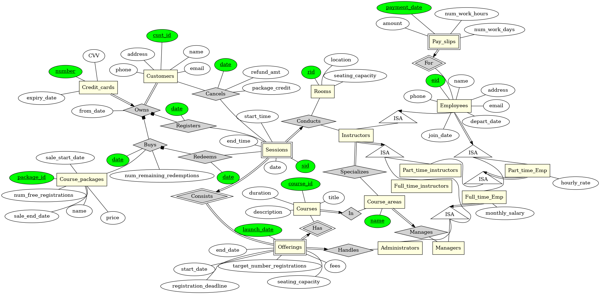
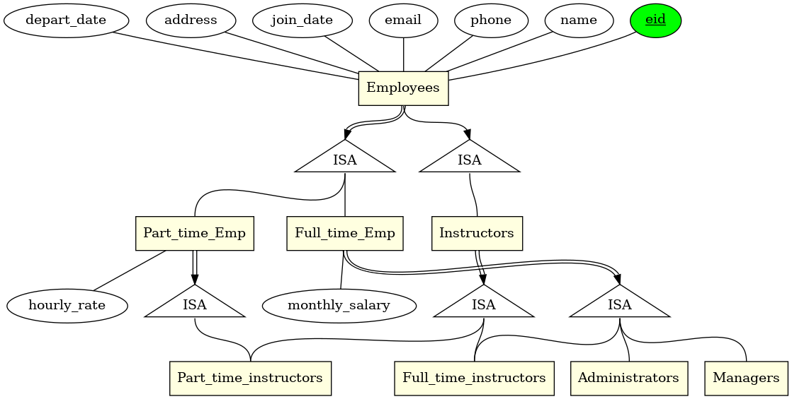

Todo

- [ ] Standardise naming scheme (Camel case OR?)
- [ ] Check if all the schema is in place
- [ ] Update diagram to reflect table status
- [ ] Check if there are any constraints not put into place
- [ ] Populate with test data

Scheme

- Merge handles into course offering
- Courses merge with

# CS2102 Project (28 marks)

## Project Tasks
You are to develop a database application for a IT company that conducts training courses. The project consists of the following five tasks.

1. Design a ER data model for the application. Your ER model should capture as many of the application's constraints as possible.

2. Translate your ER data model into a relational database schema. Your relational schema should enforce as many of the application's constraints as possible.

3. Implement a SQL or PL/pgSQL function/procedure for each of the functionalities listed in Application Functionalities. You should implement appropriate triggers (if necessary) to enforce all the application's constraints. You may use any of the PostgreSQL's features and any SQL or PL/pgSQL constructs beyond what is covered in class.

4. Populate each table in your database with synthetic data. Each table should have at least 10 records. You may use online data generators (e.g., https://mockaroo.com, https://www.generatedata.com) or write your own scripts to generate the synthetic data.

5. For each table R in your database schema that is not in 3NF, find a dependency-preserving BCNF decomposition of R if it exists; if not, find a 3NF decomposition of R.

## Application
The company conducts various one-day IT courses throughout the year. Each course has a unique course identifier, a unique course title (e.g., 'Advanced SQL'), a course description, a course area (e.g., Database Systems, Networking), and a duration (in terms of number of hours). Each course could be offered multiple times a year. Each course offering has the following information: course fees, a target number of registrations, launch date for the offering, and registration deadline for the offering. The offerings for the same course have different launch dates. Each course offering is handled by an administrator.

Each course offering consists of one or more sessions, where each session is conducted by an instructor on a specific weekday (Monday to Friday) at a specific hour in some lecture room within the company. There could be multiple instructors assigned to conduct the different sessions for a course offering. The earliest session can start at 9am and the latest session (for each day) must end by 6pm, and no sessions are conducted between 12pm to 2pm. The sessions for a course offering are numbered consecutively starting from 1; we refer to these as session numbers. No two sessions for the same course offering can be conducted on the same day and at the same time. Each course offering has a start date and an end date that is determined by the dates of its earliest and latest sessions, respectively. As an example, a course offering which consists of four sessions conducted on March 8 at 10am, March 8 at 3pm, March 11 at 11am, and March 12 at 3pm would have a start date of March 8 and an end date of March 12. The registration deadline for a course offering must be at least 10 days before its start date.

For each course offered by the company, a customer can register for at most one of its sessions before its registration deadline. The seating capacity of a course session is equal to the seating capacity of the room where the session is conducted, and the seating capacity of a course offering is equal to the sum of the seating capacities of its sessions. A course offering is said to be available if the number of registrations received is no more than its seating capacity; otherwise, we say that a course offering is fully booked.

Customers could also purchase promotional course packages sold by the company. Each course package allows a customer to register free-of-charge for a fixed number of course sessions which can be redeemed for any course offering. The company may have multiple course packages on sale at any one time. Each course package has a unique package identifier, a package name, the number of free course sessions, a start and end date indicating the duration that the promotional package is available for sale, and the price of the package.

A customer's course package is classified as either active if there is at least one unused session in the package, partially active if all the sessions in the package have been redeemed but there is at least one redeemed session that could be refunded if it is cancelled, or inactive otherwise. Each customer can have at most one active or partially active package.

For each registered course, a customer pays for the course fees by either making a credit card payment or redeeming a session from his/her active course package. The date of the registration is recorded in the database.

For a credit card payment, the company's cancellation policy will refund 90% of the paid fees for a registered course if the cancellation is made at least 7 days before the day of the registered session; otherwise, there will no refund for a late cancellation. For a redeemed course session, the company's cancellation policy will credit an extra course session to the customer's course package if the cancellation is made at least 7 days before the day of the registered session; otherwise, there will no refund for a late cancellation.

Course packages must be purchased using credit card payment and they can't be refunded. Each course package sold to a customer has the date of the transaction.

Each customer has a unique customer identifier, name, home address, contact number, email address, and information of a credit card (credit card number, expiry date, CVV code).

For each lecture room in the company's office, the following information is maintained: its unique room identifier, its location (in terms of the floor and room numbers), and its maximum seating capacity. Each room can be used to conduct at most one course session at any time.

Each employee in the company is either a manager, an administrator, or an instructor. Each employee has a unique identifier, name, home address, contact number, email address, salary information, date that the employee joined the company, and date that the employee departed the company (the value is null if an employee is still employed by the company). All managers and administrators are full-time employees while instructors could be full-time or part-time employees. Each full-time employee has a fixed monthly salary, while each part-time instructor has a fixed hourly rate and his/her monthly salary is computed based on the total number of hours worked for that month.

Each instructor specializes in a set of one or more course areas, and an instructor who is assigned to teach a course session must be specialized in that course area. Each instructor can teach at most one course session at any hour. Each instructor must not be assigned to teach two consecutive course sessions; i.e., there must be at least one hour of break between any two course sessions that the instructor is teaching. Each part-time instructor must not teach more than 30 hours for each month.

Each manager manages zero or more course areas, and each course area is managed by exactly one manager. Each course offering is managed by the manager of that course area.

At the end of each month, the company pays salaries to its employees. Each salary payment to a full-time employee has the following information: date of payment, number of work days for the month, monthly salary, and salary amount. The salary amount is given by the product of the employee's monthly salary and the ratio given by the number of work days for the month to the number of days in the month. The number of work days for the month is given by (last work day - first work day + 1). The first work day is equal to day of the employee's joined date if the employee's joined date is within the month of payment; otherwise, it is equal to 1. The last work day is equal to day of the employee's departed date if the employee's departed date is within the month of payment; otherwise, it is equal to the number of days in the month. Each salary payment to a part-time employee has the following information: date of payment, number of work hours for the month, hourly rate, and salary amount. The salary amount is given by the product of the employee's hourly rate and the number of work hours for the month.

## Suggested ER Diagram

## Application Functionalities
Your application must support the following functionalities, each of which is to be implemented as a SQL or PL/pgSQL routine (i.e., function or procedure). Some of these routines return a JSON value. PostgreSQL provides many useful functions for JSON data type (e.g., row_to_json, json_agg).

Note that the specifications for the routines are incomplete by design; for example, the data types for the input parameters are not specified, and certain parameters (e.g., course offering identifier) are not explicitly defined. For any criterion/process/design issue that is not explicitly stated, you are free to decide on how to address that issue in a reasonable way and justify your decisions in your project report.

1. **add_employee**: This routine is used to add a new employee. The inputs to the routine include the following: name, home address, contact number, email address, salary information (i.e., monthly salary for a full-time employee or hourly rate for a part-time employee), date that the employee joined the company, the employee category (manager, administrator, or instructor), and a (possibly empty) set of course areas. If the new employee is a manager, the set of course areas refers to the areas that are managed by the manager. If the new employee is an instructor, the set of course areas refers to the instructor's specialization areas. The set of course areas must be empty if the new employee is a administrator; and non-empty, otherwise. The employee identifier is generated by the system.  
_**Note:** This should be working already. Inserts into Employees, FullTimeEmployees/PartTimeEmployees, Managers/Administrators/Instructors and FullTimeInstructors/PartTimeInstructors and CourseAreas if applicable. Returns employee_id for new employee added. Maybe we can abstract out course area creation as a function so it's easier for testing._

2. **remove_employee**: This routine is used to update an employee's departed date a non-null value. The inputs to the routine is an employee identifier and a departure date. The update operation is rejected if any one of the following conditions hold: (1) the employee is an administrator who is handling some course offering where its registration deadline is after the employee's departure date; (2) the employee is an instructor who is teaching some course session that starts after the employee's departure date; or (3) the employee is a manager who is managing some area.  

3. **add_customer**: This routine is used to add a new customer. The inputs to the routine include the following: name, home address, contact number, email address, and credit card details (credit card number, expiry date, CVV code). The customer identifier is generated by the system.  
_**Note:** This should be working already. Inserts into Customers, CreditCards, Owns accordingly. Returns customer_id for new customer added._

4. **update_credit_card**: This routine is used when a customer requests to change his/her credit card details. The inputs to the routine include the customer identifier and his/her new credit card details (credit card number, expiry date, CVV code).  
_**Note:** This should be working already. Inserts a new record into CreditCards and Owns. Does not return anything._

5. **add_course**: This routine is used to add a new course. The inputs to the routine include the following: course title, course description, course area, and duration. The course identifier is generated by the system.  
_**Note:** This should be working already. Inserts a new record into Courses. Returns course_id for new course added._

6. **find_instructors**: This routine is used to find all the instructors who could be assigned to teach a course session. The inputs to the routine include the following: course identifier, session date, and session start hour. The routine returns a table of records consisting of employee identifier and name.  

7. **get_available_instructors**: This routine is used to retrieve the availability information of instructors who could be assigned to teach a specified course. The inputs to the routine include the following: course identifier, start date, and end date. The routine returns a table of records consisting of the following information: employee identifier, name, total number of teaching hours that the instructor has been assigned for this month, day (which is within the input date range [start date, end date]), and an array of the available hours for the instructor on the specified day. The output is sorted in ascending order of employee identifier and day, and the array entries are sorted in ascending order of hour.  

8. **find_rooms**: This routine is used to find all the rooms that could be used for a course session. The inputs to the routine include the following: session date, session start hour, and session duration. The routine returns a table of room identifiers.  

9. **get_available_rooms**: This routine is used to retrieve the availability information of rooms for a specific duration. The inputs to the routine include a start date and an end date. The routine returns a table of records consisting of the following information: room identifier, room capacity, day (which is within the input date range [start date, end date]), and an array of the hours that the room is available on the specified day. The output is sorted in ascending order of room identifier and day, and the array entries are sorted in ascending order of hour.  

10. **add_course_offering**: This routine is used to add a new offering of an existing course. The inputs to the routine include the following: course offering identifier, course identifier, course fees, launch date, registration deadline, administrator's identifier, and information for each session (session date, session start hour, and room identifier). If the input course offering information is valid, the routine will assign instructors for the sessions. If a valid instructor assignment exists, the routine will perform the necessary updates to add the course offering; otherwise, the routine will abort the course offering addition. Note that the seating capacity of the course offering must be at least equal to the course offering's target number of registrations.  
_**Note:** This should be working but is incomplete. Need to implement logic for accepting/adding sessions and assigning instructors etc. Should return course offering ID._

11. **add_course_package**: This routine is used to add a new course package for sale. The inputs to the routine include the following: package name, number of free course sessions, start and end date indicating the duration that the promotional package is available for sale, and the price of the package. The course package identifier is generated by the system. If the course package information is valid, the routine will perform the necessary updates to add the new course package.  
_**Note:** This should be working already. Inserts a new record into CoursePackages. Returns package_id for new course package added._

12. **get_available_course_packages**: This routine is used to retrieve the course packages that are available for sale. The routine returns a table of records with the following information for each available course package: package name, number of free course sessions, end date for promotional package, and the price of the package.  

13. **buy_course_package**: This routine is used when a customer requests to purchase a course package. The inputs to the routine include the customer and course package identifiers. If the purchase transaction is valid, the routine will process the purchase with the necessary updates (e.g., payment).  

14. **get_my_course_package**: This routine is used when a customer requests to view his/her active/partially active course package. The input to the routine is a customer identifier. The routine returns the following information as a JSON value: package name, purchase date, price of package, number of free sessions included in the package, number of sessions that have not been redeemed, and information for each redeemed session (course name, session date, session start hour). The redeemed session information is sorted in ascending order of session date and start hour.  

15. **get_available_course_offerings**: This routine is used to retrieve all the available course offerings that could be registered. The routine returns a table of records with the following information for each course offering: course title, course area, start date, end date, registration deadline, course fees, and the number of remaining seats. The output is sorted in ascending order of registration deadline and course title.  

16. **get_available_course_sessions**: This routine is used to retrieve all the available sessions for a course offering that could be registered. The input to the routine is a course offering identifier. The routine returns a table of records with the following information for each available session: session date, session start hour, instructor name, and number of remaining seats for that session. The output is sorted in ascending order of session date and start hour.  

17. **register_session**: This routine is used when a customer requests to register for a session in a course offering. The inputs to the routine include the following: customer identifier, course offering identifier, session number, and payment method (credit card or redemption from active package). If the registration transaction is valid, this routine will process the registration with the necessary updates (e.g., payment/redemption).  

18. **get_my_registrations**: This routine is used when a customer requests to view his/her active course registrations (i.e, registrations for course sessions that have not ended). The input to the routine is a customer identifier. The routine returns a table of records with the following information for each active registration session: course name, course fees, session date, session start hour, session duration, and instructor name. The output is sorted in ascending order of session date and session start hour.  

19. **update_course_session**: This routine is used when a customer requests to change a registered course session to another session. The inputs to the routine include the following: customer identifier, course offering identifier, and new session number. If the update request is valid and there is an available seat in the new session, the routine will process the request with the necessary updates.  

20. **cancel_registration**: This routine is used when a customer requests to cancel a registered course session. The inputs to the routine include the following: customer identifier, and course offering identifier. If the cancellation request is valid, the routine will process the request with the necessary updates.  

21. **update_instructor**: This routine is used to change the instructor for a course session. The inputs to the routine include the following: course offering identifier, session number, and identifier of the new instructor. If the course session has not yet started and the update request is valid, the routine will process the request with the necessary updates.  

22. **update_room**: This routine is used to change the room for a course session. The inputs to the routine include the following: course offering identifier, session number, and identifier of the new room. If the course session has not yet started and the update request is valid, the routine will process the request with the necessary updates. Note that update request should not be performed if the number of registrations for the session exceeds the seating capacity of the new room.  

23. **remove_session**: This routine is used to remove a course session. The inputs to the routine include the following: course offering identifier and session number. If the course session has not yet started and the request is valid, the routine will process the request with the necessary updates. The request must not be performed if there is at least one registration for the session. Note that the resultant seating capacity of the course offering could fall below the course offering's target number of registrations, which is allowed.  

24. **add_session**: This routine is used to add a new session to a course offering. The inputs to the routine include the following: course offering identifier, new session number, new session day, new session start hour, instructor identifier for new session, and room identifier for new session. If the course offering's registration deadline has not passed and the the addition request is valid, the routine will process the request with the necessary updates.  
_**Note:** This should be working but is incomplete. Need to implement logic for room availabiliy and instructor availability. Don't think need to return anything_

25. **pay_salary**: This routine is used at the end of the month to pay salaries to employees. The routine inserts the new salary payment records and returns a table of records (sorted in ascending order of employee identifier) with the following information for each employee who is paid for the month: employee identifier, name, status (either part-time or full-time), number of work days for the month, number of work hours for the month, hourly rate, monthly salary, and salary amount paid. For a part-time employees, the values for number of work days for the month and monthly salary should be null. For a full-time employees, the values for number of work hours for the month and hourly rate should be null.  

26. **promote_courses**: This routine is used to identify potential course offerings that could be of interest to inactive customers. A customer is classified as an active customer if the customer has registered for some course offering in the last six months (inclusive of the current month); otherwise, the customer is considered to be inactive customer. A course area A is of interest to a customer C if there is some course offering in area A among the three most recent course offerings registered by C. If a customer has not yet registered for any course offering, we assume that every course area is of interest to that customer. The routine returns a table of records consisting of the following information for each inactive customer: customer identifier, customer name, course area A that is of interest to the customer, course identifier of a course C in area A, course title of C, launch date of course offering of course C that still accepts registrations, course offering's registration deadline, and fees for the course offering. The output is sorted in ascending order of customer identifier and course offering's registration deadline.  

27. **top_packages**: This routine is used to find the top N course packages in terms of the total number of packages sold for this year (i.e., the package's start date is within this year). The input to the routine is a positive integer number N. The routine returns a table of records consisting of the following information for each of the top N course packages: package identifier, number of included free course sessions, price of package, start date, end date, and number of packages sold. The output is sorted in descending order of number of packages sold followed by descending order of price of package. In the event that there are multiple packages that tie for the top Nth position, all these packages should be included in the output records; thus, the output table could have more than N records. It is also possible for the output table to have fewer than N records if N is larger than the number of packages launched this year.  

28. **popular_courses**: This routine is used to find the popular courses offered this year (i.e., start date is within this year). A course is popular if the course has at least two offerings this year, and for every pair of offerings of the course this year, the offering with the later start date has a higher number of registrations than that of the offering with the earlier start date. The routine returns a table of records consisting of the following information for each popular course: course identifier, course title, course area, number of offerings this year, and number of registrations for the latest offering this year. The output is sorted in descending order of the number of registrations for the latest offering this year followed by in ascending order of course identifier.  

29. **view_summary_report**: This routine is used to view a monthly summary report of the company's sales and expenses for a specified number of months. The input to the routine is a number of months (say N) and the routine returns a table of records consisting of the following information for each of the last N months (starting from the current month): month and year, total salary paid for the month, total amount of sales of course packages for the month, total registration fees paid via credit card payment for the month, total amount of refunded registration fees (due to cancellations) for the month, and total number of course registrations via course package redemptions for the month. For example, if the number of specified months is 3 and the current month is January 2021, the output will consist of one record for each of the following three months: January 2021, December 2020, and November 2020.  

30. **view_manager_report**: This routine is used to view a report on the sales generated by each manager. The routine returns a table of records consisting of the following information for each manager: manager name, total number of course areas that are managed by the manager, total number of course offerings that ended this year (i.e., the course offering's end date is within this year) that are managed by the manager, total net registration fees for all the course offerings that ended this year that are managed by the manager, the course offering title (i.e., course title) that has the highest total net registration fees among all the course offerings that ended this year that are managed by the manager; if there are ties, list all these top course offering titles. The total net registration fees for a course offering is defined to be the sum of the total registration fees paid for the course offering via credit card payment (excluding any refunded fees due to cancellations) and the total redemption registration fees for the course offering. The redemption registration fees for a course offering refers to the registration fees for a course offering that is paid via a redemption from a course package; this registration fees is given by the price of the course package divided by the number of sessions included in the course package (rounded down to the nearest dollar). There must be one output record for each manager in the company and the output is to be sorted by ascending order of manager name.
